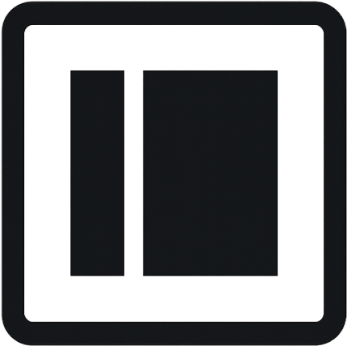

<h1 align="center">EdgePane —— Pane Perfect Experience</h1>

<p align="center">
  Beautiful and customizable sidebar component.
</p>

<p align="center">
  <a href="./docs/license.html">
    
  </a>
  
  
</p>

---

## 📖 Documentation

Full documentation is available here:  
👉 [EdgePane Docs](https://ezex377.github.io/EdgePane/index.html)

---

## 🚀 Installation (via CDN)

Add the following to your HTML:

```html
<link rel="stylesheet" href="https://ezex377.github.io/EdgePane/dist/edgepane.min.css" />
<script src="https://ezex377.github.io/EdgePane/dist/edgepane.min.js"></script>
```
---

## ⚡ Basic usage

HTML:

```html
<!-- Sidebar -->
<nav class="egp-sidebar bg-neutral-800" role="navigation">

  <!-- Sidebar Header -->
  <div class="egp-sidebar-header">
    
    <div class="egp-sidebar-title">
      <p class="egp-sidebar-brand-name">EdgePane</p>
      <p class="egp-sidebar-brand-tagline">Pane Perfect Experience</p>
    </div>
  </div>

  <!-- Sidebar Menu -->
  <ul class="egp-sidebar-menu">
    <li class="egp-sidebar-section-heading" data-section-heading="MAIN NAVIGATION"></li>
    <li>
      <a href="#" class="egp-sidebar-link">
        <span class="egp-sidebar-link-icon"><i class="bi bi-house"></i></span>
        <span class="egp-sidebar-link-text">Dashboard</span>
      </a>
    </li>
    <li>
      <a href="#" class="egp-sidebar-link">
        <span class="egp-sidebar-link-icon"><i class="bi bi-gear"></i></span>
        <span class="egp-sidebar-link-text">Settings</span>
      </a>
    </li>
    <li class="egp-has-dropdown">
      <a href="#" class="egp-sidebar-link">
        <span class="egp-sidebar-link-icon"><i class="bi bi-folder"></i></span>
        <span class="egp-sidebar-link-text">Projects</span>
        <span class="egp-sidebar-dropdown-icon"><i class="bi bi-chevron-down"></i></span>
      </a>
      <ul class="egp-sidebar-dropdown-menu">
        <li><a href="#">Project A</a></li>
        <li><a href="#">Project B</a></li>
      </ul>
    </li>
  </ul>
</nav>

<!-- Main Content -->
<div class="egp-main-content">
  <button class="egp-sidebar-toggle">☰</button>
  <h1>Welcome</h1>
</div>

<!-- Overlay -->
<div class="egp-sidebar-overlay"></div>
```

JS:

```js
edgePane.init({
    sidebarState: "open",
    hoverExpand: true,
    closeOnClickOutside: true,
    dropdownMode: "single",
    rememberDropdowns: true,
    fontFamily: "'Montserrat', sans-serif",
    sidebarWidth: "18rem",
    sidebarColor: "rgba(225,225,225,1)",
    textColor: "rgba(70,70,70,1)",
    activeLinkBg: "rgba(180,180,180,1)",
    activeLinkColor: "rgba(70,70,70,1)",
    showBrand: true,
    onSidebarToggle: function (state) {
        console.log("Sidebar state changed →", state);
        // Example: update a status badge
        document.querySelector("#sidebarStatus").textContent = state;
    },
    onDropdownToggle: function (id, isOpen) {
        console.log("Dropdown toggled →", id, "Open:", isOpen);
        // Example: highlight the dropdown if open
        const el = document.getElementById(id);
        if (el) {
            el.style.backgroundColor = isOpen ? "rgba(0,150,136,0.1)" : "transparent";
        }
    },
});
```

---

## 📜  MIT License

<sub>MIT License</sub>

<sub>Copyright (c) 2025 Ronny Das</sub>

<sub>Permission is hereby granted, free of charge, to any person obtaining a copy of this software and associated documentation files (the "Software"), to deal in the Software without restriction, including 
without limitation the rights to use, copy, modify, merge, publish, distribute, sublicense, and/or sell copies of the Software, and to permit persons to whom the Software is furnished to do so, subject to 
the following conditions: </sub>

<sub>The above copyright notice and this permission notice shall be included in all copies or substantial portions of the Software.</sub>

<sub>THE SOFTWARE IS PROVIDED "AS IS", WITHOUT WARRANTY OF ANY KIND, EXPRESS OR IMPLIED, INCLUDING BUT NOT LIMITED TO THE WARRANTIES OF MERCHANTABILITY,
FITNESS FOR A PARTICULAR PURPOSE AND NONINFRINGEMENT. IN NO EVENT SHALL THE AUTHORS OR COPYRIGHT HOLDERS BE LIABLE FOR ANY CLAIM, DAMAGES OR OTHER 
LIABILITY, WHETHER IN AN ACTION OF CONTRACT, TORT OR OTHERWISE, ARISING FROM, OUT OF OR IN CONNECTION WITH THE SOFTWARE OR THE USE OR OTHER DEALINGS IN THE
SOFTWARE.</sub>